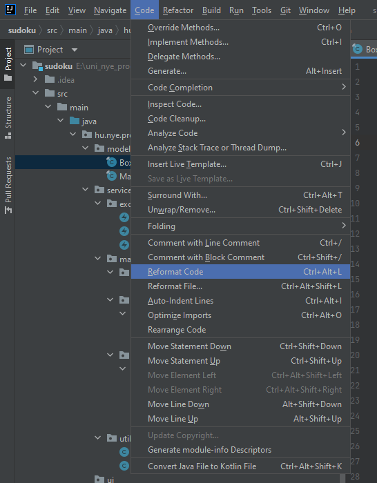

# Tippek a fejlesztéshez

## JaCoCo kikapcsolása

Ha a unit tesztekkel nincs meg a kellő lefedettség, a JaCoCo plugin el fogja buktatni a projekt buildelését (pl.: `mvn clean install` esetén).

Ha ideiglenesen ettől szeretnétek megszabadulni, kikommentelhetitek vagy kitörölhetitek a JaCoCo plugint, vagy csak azon belül a `jacoco-check` `id`-valrendelkező `<execution>` részt.

**Később ezt mindenképp állítsátok vissza!**

Példa a kikommentelésre:

```xml
<!-- TODO: Ne felejtsd el visszavonni a kommentelést!
<execution>
    <id>jacoco-check</id>
    <goals>
        <goal>check</goal>
    </goals>
    <configuration>
        <rules>
            <rule>
                <element>CLASS</element>
                <limits>
                    <limit>
                        <counter>LINE</counter>
                        <value>COVEREDRATIO</value>
                        <minimum>0.8</minimum>
                    </limit>
                </limits>
            </rule>
        </rules>
    </configuration>
</execution>
-->
```

## Checkstyle kikapcsolása

Ha a kódotok nem felel meg a `checkstyle.xml`-ben megfogalmazott követelményeknek, akkor a Checkstyle plugin buktatni fogja a buildet.

Ha ideiglenesen ettől szeretnétek megszabadulni, kikommentelhetitek vagy kitörölhetitek a Checkstyle plugint, vagy csak azon belül a `validate` `id`-valrendelkező `<execution>` részt.

**Később ezt mindenképp állítsátok vissza!**

Példa a kikommentelésre:

```xml
<!-- TODO: Ne felejtsd el visszavonni a kommentelést!
<execution>
    <id>validate</id>
    <phase>validate</phase>
    <goals>
        <goal>check</goal>
    </goals>
</execution>
-->
```

## IntelliJ IDEA importok sorrendje

Érdemes beállítani egy import sorrendet, így a Java forrásfájljaink elején rendezettebb formában fognak megjelenni a felhasznált importok.

**Ez fontos lehet, mert a Checkstyle konfigurációnk és hibát dobhat, ha nem megfelelő az importok sorrendje, csoportosítása!**

Beállítási útvonal: `File` -> `Settings` -> `Editor` -> `Code Style` -> `Java` -> `Imports` fül -> Legalul az `Import Layout` rész

Az Import Layout résznek pontosan a következőt kell tartalmaznia (hogy a checkstyle.xml-ünknek megfeleljen):

- `import static all other imports`
- `<blank line>`
- `import javax.*`
- `import java.*`
- `<blank line>`
- `import all other imports`

Hogy automatikusan átrendezd a már meglévő importokat egy adott Java fájl esetén, használd az `Organize Imports` lehetőséget (lásd a következő szekció)


## IntelliJ IDEA kód formázása és importok rendezése

Érdemes használni az IDEA kód formázáshoz kapcsolódó eszközeit, hogy a kódunk ne csak jól működjön, de rendezettebb, könnyebben olvashatóbb is legyen.

Ha kinyitottok egy forrásfájlt, felül a `Code` menüpontból érdemes lehet az alábbi utasításokat megfuttatni:

- `Reformat Code`
- `Auto-Indent Lines`
- `Optimize Imports`

(Ezt a három lépést akár egy `Macro` majd egy gyorsgomb formájában össze is lehet fűzni, akit érdekel, nyugodtan nézzen utána.)


